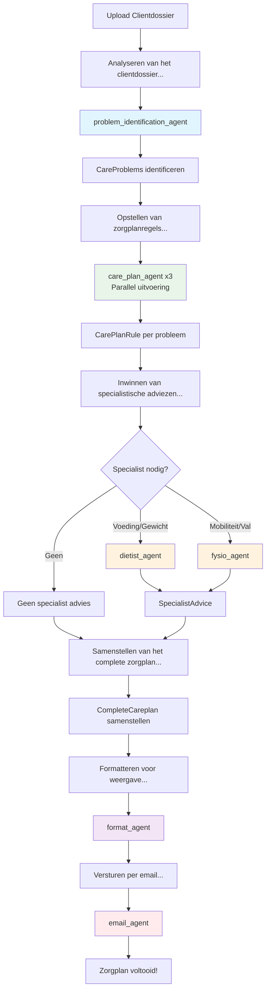

```mermaid
flowchart TD
    A[Upload Clientdossier] --> B[Analyseren van het clientdossier...]
    B --> C[problem_identification_agent]
    C --> D[CareProblems identificeren]
    D --> E[Opstellen van zorgplanregels...]
    E --> F[care_plan_agent x3<br/>Parallel uitvoering]
    F --> G[CarePlanRule per probleem]
    G --> H[Inwinnen van specialistische adviezen...]
    H --> I{Specialist nodig?}
    I -->|Voeding/Gewicht| J[dietist_agent]
    I -->|Mobiliteit/Val| K[fysio_agent]
    I -->|Geen| L[Geen specialist advies]
    J --> M[SpecialistAdvice]
    K --> M
    L --> N[Samenstellen van het complete zorgplan...]
    M --> N
    N --> O[CompleteCareplan samenstellen]
    O --> P[Formatteren voor weergave...]
    P --> Q[format_agent]
    Q --> R[Versturen per email...]
    R --> S[email_agent]
    S --> T[Zorgplan voltooid!]
    
    style C fill:#e1f5fe
    style F fill:#e8f5e8
    style J fill:#fff3e0
    style K fill:#fff3e0
    style Q fill:#f3e5f5
    style S fill:#ffebee
```
